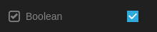

As I previously wrote in [Switching from Notion to Obsidian](https://www.notion.so/Switching-from-Notion-to-Obsidian-40b60ca5f91349ef8fa6ad2f66c56142?pvs=21) , I started down a path of implementing my planning workflow in Obsidian. But having recently moved to it from Notion, I missed some of Notion's features. But fear not, the Obsidian plugin ecosystem comes to the rescue.

## How is it done?

The most helpful resource when looking at how to create Obsidian plugins was the [unofficial Plugin Developer Docs](https://marcus.se.net/obsidian-plugin-docs/). It contains a [Getting started](https://marcus.se.net/obsidian-plugin-docs/getting-started/create-your-first-plugin) section, explanation of different Obsidian concepts like the [Vault](https://marcus.se.net/obsidian-plugin-docs/concepts/vault), and also gives several guides for the most common actions a plugin might want to do, like creating [custom commands](https://marcus.se.net/obsidian-plugin-docs/guides/commands), displaying [modals](https://marcus.se.net/obsidian-plugin-docs/guides/modals), etc. After you go through the available information, you should have a basic overview of what is possible to achieve with Obsidian plugins, and how to do it. But if you are like me, you won't be satisfied with just basic stuff, you want to do awesome custom stuff, that's why you chose Obsidian.

The next best resource to study is the source code of existing plugins. The household names like [obsidian-tasks](https://github.com/obsidian-tasks-group/obsidian-tasks), [natural language dates](https://github.com/argenos/nldates-obsidian) and [dataview](https://github.com/blacksmithgu/obsidian-dataview) are great ones to start at. A great way to dive in might be to fork and modify or extend these plugins, as opposed to creating something from scratch yourself.

## What should it do?

I wanted to start with something simple, but still useful. Coming from Notion, I was used to boolean properties with checkboxes.



The Obsidian equivalent is a dataview boolean field like: `Boolean:: true`, which has neither the convenience provided by the checkbox, nor its visibility. So I set out to create a plugin that would allow me to toggle these boolean values via checkbox like in Notion.

## CodeMirror plugin type

The editor used in Obsidian is the [CodeMirror](https://codemirror.net/) code editor. Fortunately, Obsidian also allows you to create and add CM (CodeMirror) plugins. The starting document if you have not develop CM plugins yet is the [System Guide](https://codemirror.net/docs/guide/) , which describes the overall architecture of the editor.
Figuring out that what I wanted to do would be accomplished by creating an extensions that adds a [decoration](https://codemirror.net/examples/decoration/). I started going through the documentation. And what do you know! The example code adds a "Boolean Toggle Widget" 😆. All I had to do after that was follow the example code, hook the plugin up through Obsidian API, and it just worked!

## Implementation and code samples

First, we need to create the CM widget that will be displayed on screen:

```tsx
const TOGGLE_CLASSNAME = "bif-boolean-toggle";

/**
 * CodeMirror widget that displays a checkbox
 */
class CheckboxWidget extends WidgetType {
  constructor(readonly checked: boolean) {
    super();
  }

  eq(other: CheckboxWidget) {
    return other.checked == this.checked;
  }

  toDOM() {
    const box = document.createElement("input");
    box.className = TOGGLE_CLASSNAME;
    box.type = "checkbox";
    box.checked = this.checked;
    return box;
  }

  ignoreEvent(_event: Event): boolean {
    return false;
  }
}
```

To determine all the places that will need the widget in a given document, we create a generic function to find indices of given string in text:

```tsx
/**
 * General function to get all starting indexes of given string
 * @param text Text that is being searched through.
 * @param search Text that is being searched.
 */
function getIndicesOf(text: string, search: string): number[] {
  const indices: number[] = [];
  if (!text) return indices;

  let startIndex = 0;
  let index;
  while ((index = text.indexOf(search, startIndex)) >= 0) {
    indices.push(index);
    startIndex = index + search.length;
  }

  return indices;
}
```

Then we need a function that creates CM Decorator, which just describes the text location at which our widget will be displayed:

```tsx
const TRUE_VALUE = ":: true";
const FALSE_VALUE = ":: false";

/**
 * Creates a decorator of given kind.
 * @param index Target index of the decorator
 * @param kind type of checkbox
 * @param from starting position
 * @param replace If the widget should replace the value text or not
 */
function createDecorator(
  index: number,
  kind: boolean,
  from: number,
  replace: boolean
): [Decoration, number, number] | null {
  let deco: Decoration;
  if (replace) {
    deco = Decoration.replace({
      widget: new CheckboxWidget(kind),
    });
  } else {
    deco = Decoration.widget({
      widget: new CheckboxWidget(kind),
      side: 1,
    });
  }

  const fromIndex = from + index + 3;
  const toIndex =
    fromIndex - 3 + (kind ? TRUE_VALUE.length : FALSE_VALUE.length);
  if (replace) {
    return [deco, fromIndex, toIndex];
  } else {
    return [deco, toIndex, toIndex];
  }
}
```

After that we create a function that adds decorators for a given line of text. We need to search for all true & false values in the line, get their indexes, sort them (this is important! CM requires that the decorates be sorted properly), and add all the decorators. The `shouldReplace` argument is not actually used yet, but is added as a preparation for the option to hide textual representation of value while showing just the checkbox.

```tsx
/**
 * Adds all decorators for particular line to given builder. */ function addDecoratorsForLine(
  line: string,
  from: number,
  builder: RangeSetBuilder<Decoration>,
  shouldReplace: boolean
) {
  const trueIndices = getIndicesOf(line, TRUE_VALUE).map(index => ({
    index,
    kind: true,
  }));
  const falseIndices = getIndicesOf(line, FALSE_VALUE).map(index => ({
    index,
    kind: false,
  }));
  const allIndices = trueIndices
    .concat(falseIndices)
    // All added decorators need to be added to the set sorted by index
    .sort(({ index: indexA }, { index: indexB }) => indexA - indexB);

  allIndices.forEach(({ kind, index }) => {
    const decoratorInfo = createDecorator(index, kind, from, shouldReplace);
    if (!decoratorInfo) return;

    const [decorator, fromIndex, toIndex] = decoratorInfo;
    builder.add(fromIndex, toIndex, decorator);
  });
}
```

Then we have a function that adds decorators to all **visible** lines in a given document. The `visible` part allows us to skip looking through text that might be off screen or folded away.

```tsx
/**
 * Returns all CodeMirror checkbox decorators for boolean values.
 */
function getCheckboxDecorators(view: EditorView) {
  const builder = new RangeSetBuilder<Decoration>();
  // We iterate over the visible ranges
  for (const { from, to } of view.visibleRanges) {
    const startLine = view.state.doc.lineAt(from);
    const endLine = view.state.doc.lineAt(to);

    for (const lineNumber of range(startLine.number, endLine.number)) {
      const line = view.state.doc.line(lineNumber);
      addDecoratorsForLine(line.text, line.from, builder, false);
    }
  }

  return builder.finish();
}
```

This all adds a checkbox widget next to the boolean value, but it would not be of much use if it did not allow us to actually change the value by clicking it. The following function does just that using the CM state change API:

```tsx
/**
 * Toggles boolean value on given position.
 */
const toggleBoolean = (view: EditorView, pos: number) => {
  const before = view.state.doc.sliceString(Math.max(0, pos - 5), pos);
  let changes;
  if (before === "false") {
    changes = { from: pos - 5, to: pos, insert: "true" };
  } else if (before.endsWith("true")) {
    changes = { from: pos - 4, to: pos, insert: "false" };
  } else {
    return false;
  }
  view.dispatch({ changes });
  return true;
};
```

And finally, to tie this all up we create a CM view plugin:

```tsx
/**
 * The actual CodeMirror plugin definition that is exported and used in Obsidian.
 */
export const checkboxPlugin = ViewPlugin.fromClass(
  class {
    decorations: DecorationSet;

    constructor(view: EditorView) {
      this.decorations = getCheckboxDecorators(view);
    }

    update(update: ViewUpdate) {
      if (update.docChanged || update.viewportChanged || update.selectionSet)
        this.decorations = getCheckboxDecorators(update.view);
    }
  },
  {
    decorations: value => value.decorations,
    eventHandlers: {
      mousedown: (e, view) => {
        const target = e.target as HTMLElement;
        if (
          target &&
          target.nodeName === "INPUT" &&
          target.classList.contains(TOGGLE_CLASSNAME)
        ) {
          return toggleBoolean(view, view.posAtDOM(target));
        }
        return false;
      },
    },
  }
);
```

## Reflection

Creating this CM plugin was a nice exercise, where I tried something pretty far out of my usual work area. It also validated an idea I had for some time, that I would really enjoy programming something that I can the use myself. The result can be seen in the [better-inline-fields](https://github.com/dsarman/better-inline-fields) repository, and I definitely plan to add more features once I find the need for them.

## Resources

- Unofficial Obsidian plugin development documentation - [https://marcus.se.net/obsidian-plugin-docs/](https://marcus.se.net/obsidian-plugin-docs/)

- Obsidian plugins:

  - obsidian-tasks - [https://github.com/obsidian-tasks-group/obsidian-tasks](https://github.com/obsidian-tasks-group/obsidian-tasks)

  - natural language dates - [https://github.com/argenos/nldates-obsidian](https://github.com/argenos/nldates-obsidian)

  - dataview - [https://github.com/blacksmithgu/obsidian-dataview](https://github.com/blacksmithgu/obsidian-dataview)

- CodeMirror

  - Main site - [https://codemirror.net/](https://codemirror.net/)

  - System Guide - [https://codemirror.net/docs/guide/](https://codemirror.net/docs/guide/)

  - Editor decoration example - [https://codemirror.net/examples/decoration/](https://codemirror.net/examples/decoration/)
