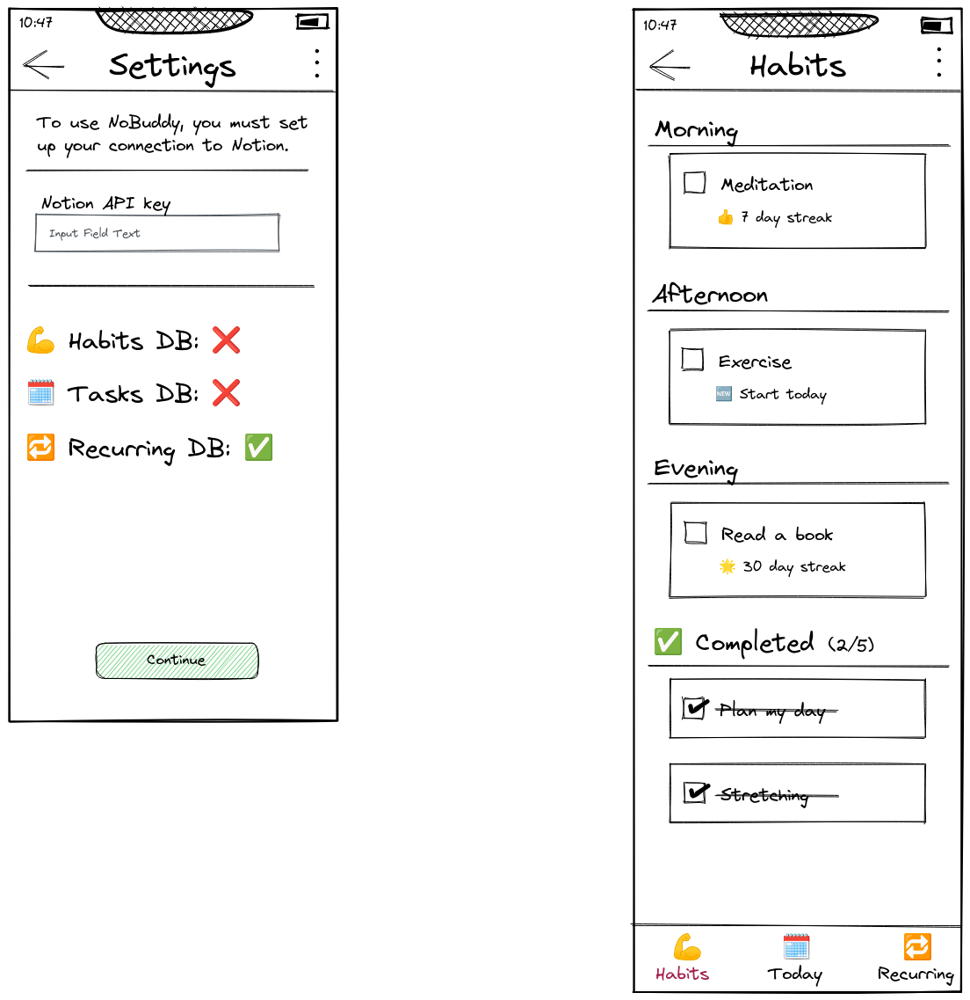
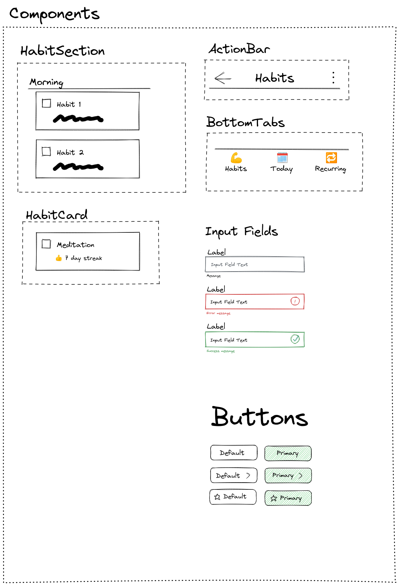

---
tags:
  - Android
  - Coding Tutorial
  - Expo
date: 2022-03-22
post-slug: nobuddy-app-first-poc
description: My first POC for a mobile app that would help me with my daily tasks.
title: NoBuddy app first POC
categories:
pubDatetime: 2022-03-22
lastMod: 2023-12-07
---

⬅️ For the previous article in the series, see <a href="/posts/new-expo-project-setup">New Expo Project Setup</a>

# What will this be about?

In previous blog posts I covered my motivation for this project, and why I made the technological choices that I did. Then I wrote about setting up the new Expo project, and what file organization strategies you can choose. But I never really explained what is it that I am building. What is this thing supposed to do? To explain this, I first need to familiarize you with several things.

## The Notion L-CTRL system

The basis for this project was me trying out the [L-CTRL](https://toolbox.co-x3.com/) Notion template. What it attempts to do is create a comprehensive and gamified “second brain” system, for storing & prioritizing all your tasks, research, meetings, etc. This is definitely nothing new, and I myself have tried various software solutions that attempted to do the same. Most of the time, I tried it, I failed to reap the rewards I was expecting, and being disillusioned, I moved to the next software (that will definitely fix it for good this time ... right?). What I only recognized after looking at [L-CTRL](https://toolbox.co-x3.com/), was that software is not enough because it is just a tool. You also need a system in place. A plan on what to do with the tool, how to use it to achieve your desired outcome. So for the past year and a half, I was trying to internalize this system. But, after a pretty long stint of me trying to shoehorn my daily regime and habit into this existing system, and failing, I realized that I need to modify this system to my needs. Take what works for me, and throw everything else out.

## Expo app

So how does my Expo app achieve the goal I just laid out? Frankly, after writing it out and thinking about it, not much. But I was looking for a new side project, I have an interest in Notion API, and hey, when all you have is a hammer, everything looks like a nail right 😄?

One particular problem that I wanted to tackle is that Notion has no concept of “repeating task”. You can add date properties to database pages, but achieving workflow akin to that of a repeating task requires jumping through several hoops, and even then, there is more manual work than I would like. So the goal becomes simple:
🎯 Create Expo app that would allow me to schedule repeating tasks, and allow me to view them in a more concise manner on mobile phone.

# The actual work

So, with goal of this POC being clear, I was almost ready to start banging out code like a madman. But then the little voice of “this is not the way” sounded in my headed again, and I though, “how can I think this through better”? At my current job (creating an RN shopping app) I found that it is hugely beneficial to have at least a mockup, if not the whole design ready and available when discussing scope, and necessary BE/API changes with the team. It grounds the discussion around concrete points, synchronizes everyone’s expectations, and allows you to see problems that you would have otherwise overlooked. So I set out to create a mockup of what I wanted the app to look like.

## Excalidraw

So, seeing as this was the first time I had to create UI mockups for myself (I have always had them prepared for me by UX before), I set out searching for the best tool for the job. I knew [Figma](https://www.figma.com/) from work, but only as a consumer, not a creator. And since this is a side project, I did not want to invest any money beforehand. Then I remembered that I glimpsed an article singing the praises of [Excalidraw](https://excalidraw.com/). It was free, no registration required, so I got to work. What I did not expect was, how much I would enjoy it. I do not know what it is about the rough, hand drawn look, but it just makes anything look better. My theory is that the handrawn look hides certain imperfections that would be more visible with perfectly straight lines. Whatever the cause, I absolutely loved the tool, and bought their premium subscription the same day. Below is an example of the mockup I created with it.





## Notion API

The next crucial step on the road to my own app was communicating with Notion. The [Notion API Beta](https://developers.notion.com/) has been in the wild for some time, and its capabilities are steadily increasing. Since there is an [official JS client](https://github.com/makenotion/notion-sdk-js) available, I took advantage of it.

At first I wanted to write about me using [jotai](https://jotai.org/), [react-query](https://react-query.tanstack.com/) and [notion-js-sdk](https://github.com/makenotion/notion-sdk-js) to fetch Notion data, with detailed code examples and walkthrough, but the idea of writing it is not fun, and has been hanging over my head for a couple of days, blocking my progress. So I will just show a quick example of a solution that I used across all Notion data sources.

[Jotai](https://jotai.org/) has integration with [react-query](https://react-query.tanstack.com/) in the form of the `atomWithQuery` atom. The way I connected it with notion SDK was by storing the Notion API key in one atom, then creating a derived atom storing the whole Notion client, and using that where needed in the actual `atomWithQuery` atoms to fetch the data as you can see below:

```tsx
/**
 * Returns information for the Habits Notion DB, if found.
 */
export const habitsDbAtom = atom(async get => {
  const notion = get(notionClientAtom);
  if (isDefined(notion)) {
    return findNotionDb(notion, "Habits");
  }
});

/**
 * Returns information about all the habits stored in Notion
 * Habit DB {@see habitsDbAtom}
 */
export const habitsAtom = atomWithQuery(get => ({
  queryKey: ["habits", get(habitsDbAtom)?.id],
  enabled: isDefined(get(habitsDbAtom)?.id),
  queryFn: async ({ queryKey: [, habitsDb] }) => {
    let result: CreatedPageResult[] = [];
    const habits = await get(notionClientAtom)?.databases?.query({
      database_id: habitsDb as string,
    });
    if (isDefined(habits) && isNotEmpty(habits.results)) {
      result = habits.results as CreatedPageResult[];
    }
    return result;
  },
  keepPreviousData: true,
}));
```

# Lessons learned

As a whole, this POC was interesting for me in several ways:

- I got great value from first mocking up the UI, then thinking about technical implementations. The productivity was noticeably better than in my previous attempts where I just jumped in straight away.

- The mobile only approach without a server has several limitations that would be hard to mitigate. I will go into more detail below.

- And perhaps the most important lesson was: I did not really need a mobile app. After I did the work and tried to use it for a week, I noticed I had to really force myself to pick up the phone, and use it. I am sitting in front of a computer for most of my day, so I found myself looking at the task dashboard in Notion, and wanting to complete a task, having to pick up the phone, open the app, and only then ticking it off. That is an unnecessary amount of steps, and made me start thinking about other options.

## Reliable mobile only app dealbreaker

The biggest problem with a native-only mobile solution for me is the inability to reliably schedule background function execution.

Firstly, lets get the obvious out of the way: If my phone is not running, there is no way it is doing what it should do. This is not a problem with a server running 24/7 with minimal downtime.

Secondly, even when the phone is running, you still cannot be sure that the code you scheduled will actually run. This is even true for native Android solutions (see [https://dontkillmyapp.com/](https://dontkillmyapp.com/)), where the manufacturer modifications to the OS and aggressive battery optimisations make relying on background execution a bad idea.

These problems were a pretty big deal for an app that should **automatically** schedule repeating Notion tasks, without your input. The obvious choice is to introduce a server that will do the scheduling, which brings a whole new host of problems and challenges.

➡️ For the next article in the series, see <a href="/posts/nobuddy-moving-to-the-web">NoBuddy 0.2 - moving to the web</a>

---

🗄 Resources

- L-CTRL toolbox site → [https://toolbox.co-x3.com/](https://toolbox.co-x3.com/)

- Figma → [https://www.figma.com/](https://www.figma.com/)

- Excalidraw → [https://excalidraw.com/](https://excalidraw.com/)

- Notion API documentation → [https://developers.notion.com/](https://developers.notion.com/)

- Notion JS client → [https://github.com/makenotion/notion-sdk-js](https://github.com/makenotion/notion-sdk-js)

- Jotai state library → [https://jotai.org/](https://jotai.org/)

- react-query library → [https://react-query.tanstack.com/](https://react-query.tanstack.com/)

- Don’t kill my app site → [https://dontkillmyapp.com/](https://dontkillmyapp.com/)
