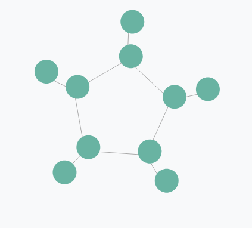
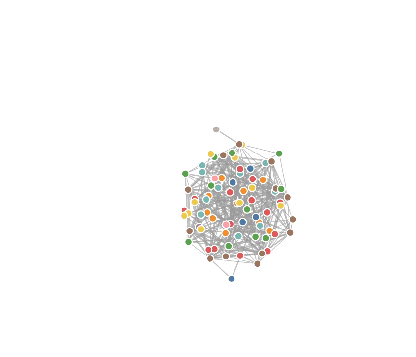
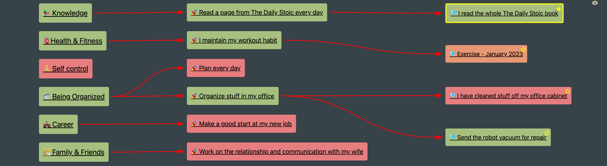

In this post I will show you my journey trying to visualise relationships in my Obsidian notes.

# Context

The way I organise anything I want to plan, prioritise, or develop, is by trying to place it in a hierarchy that I then periodically review.
You can see the big picture in the diagram below 👇.

This means that I would need some UI that is capable of displaying 3 levels of nested data (area → goal → key result). And ideally it would be easy to work with and (be) extendable, so I could add more functionality like editing, etc. in the future.

As a start I decided to try a mind map/graph visualisation since I wanted to give a little balance to the text-heavy interface of Obsidian.

# Initial library hunt

At first, I started to look for a JS mind-mapping library. There are of course many options, but the ones I seriously considered were:

- [markmap](https://markmap.js.org/) with its biggest positive being that it is based on markdown, but it would mean generating the markdown by hand only to give it to the library to visualise, which felt like a lot of work.

- [gojs](https://gojs.net/latest/index.html) which has a lot of capabilities, but is not free, which for me is a no-go for a side project.

- [react-mindmap](https://npm.io/package/react-mindmap) which seems nice, but is not maintained anymore.

- [d3](https://d3js.org/) a battle-tested library, already used in Obsidian for its native graph view.
  At this point I decided to go with d3. It seemed like the safest option, and I thought it would be a nice tool to familiarise myself with, since it is so well known.

# D3 attempt

I tried to look for examples of a graph in D3, and the ones looking most like what I wanted were in the [network graphs section](https://d3-graph-gallery.com/network.html).

But after looking at even the [simplest example](https://d3-graph-gallery.com/graph/network_basic.html) , I was kind of turned off. The code seemed like magic to me, and the API did not make much sense on first look. I tried to press on, and was kind of successful, but the result was not looking like I wanted. Next I tried to copy-paste a [much more complex graph](https://observablehq.com/@d3/force-directed-graph), all with physics force simulations, draggable nodes, etc.

But the problem with this solution was that I did not understand the code in the slightest, which made any modification a pain. The other drawback was that the physics simulation re-ran on every render. So when you were typing — and dataview was redrawing due to updates — the nodes were flying around all the time.
This ultimately led me to continue looking for another solution.

# Excalidraw evolution

I stumbled upon the [obsidian-excalidraw-plugin](https://github.com/zsviczian/obsidian-excalidraw-plugin) by accident, but it turns out that it offers a way to automatically generate Excalidraw diagrams with its [Excalidraw Automate](https://zsviczian.github.io/obsidian-excalidraw-plugin/) feature. This allows you to create diagrams with Dataview or Templater. This immediately caught my attention, because [as I wrote previously](https://www.notion.so/NoBuddy-app-first-POC-bf5ffc74b73449a58864906f00a3f37a?pvs=21), I really like Excalidraw's hand-drawn aesthetic. To adapt it to my workflow, I just slightly modified the [dataview example from the documentation](https://zsviczian.github.io/obsidian-excalidraw-plugin/Examples/dataviewjs_mindmap.html) and this is the result 👇.

And in the end, I liked the result a lot. It looked nice, and I even added colour coding for different states of each node. The biggest drawback was me not being able to scale the diagram properly. Instead I had to define a fixed size for the diagram, which did not work when resizing the Obsidian window.

Then there is the lack of customisability. For example I wanted to add Obsidian internal links to the graph, so I could click and open a given note. This proved difficult in Excalidraw automate, since I would have to modify the underlying Excalidraw library. I used the solution for a while, but after not finding any solutions to the problems I had, I set out looking for another solution yet again.

# The React way

Since I had a nice graph view which was not very extendable, I decided to write my own from scratch. Laying out the individual nodes was simple. And it worked really well! I got the Obsidian internal links working, and the layout updates when I resize the Obsidian windows. I even made the graph interactive, allowing me to see and toggle which key results were scheduled for today. I decided to use a library to create the SVG arrows connecting the nodes together. I looked at a few libraries like [react-archer](https://github.com/pierpo/react-archer), [react-arrows](https://github.com/sasza2/react-arrows), but in the end I chose [react-xarrows](https://github.com/Eliav2/react-xarrows) since it was by far the most feature-full and easy to use solution.

## The Arrow problems

After using this solution for a few weeks, I started encountering hard-to-reproduce bugs, where after viewing a combination of different files with my graph embedded, the arrows would disappear, and I would need to reload Obsidian to get them working again. That was, of course, annoying and I tried to figure out what the problem was. But I was not successful, and as it seems, I was not the only one as can be seen in [https://github.com/Eliav2/react-xarrows/issues/146](https://github.com/Eliav2/react-xarrows/issues/146).

This sent me trying other previously mentioned libraries. Since [react-archer](https://github.com/pierpo/react-archer) got an update since I last looked, I tried it. Right after finishing the implementation, I encountered a different error, where the arrows would not render at first every time, and I needed to force the block to re-render by moving the cursor inside it to display the original markdown and then back out. But compared to the need to reload all of Obsidian it was the lesser evil.

# What's next

The problems with both arrow libraries made me want to implement my own simple solution to fix these problems, so I will look around for ways to implement this, and we'll see if anything comes out of it.
